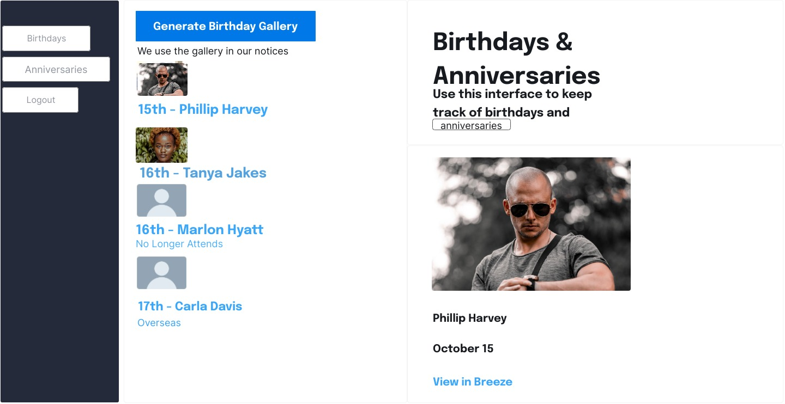

# SundayBreeze
Birthday and Anniversary Dashboard for the Breeze ChMS


## You'll need
1. An Auth0 account
2. A Breeze ChMS API Key

## Quick Start
### Installation
```
python -m venv venv
source venv/bin/activate  # On Windows, use `venv\Scripts\activate`
pip install -r requirements.txt
```
### Running the app
```
python app.py
```

## Setup Notes

This code requires a valid api key and breeze subdomain which you'll need to provide in an `.env` file
The file will look something like this
```
BREEZE_API_KEY=9419..............
SUBDOMAIN="somethingchurch"
AUTH0_CLIENT_ID=rxxxxxxxxxxxxxxxxxxxxxxxxxxx....
AUTH0_CLIENT_SECRET=_6du.................................Z6lt-
AUTH0_DOMAIN=.........................auth0.com
# set a long secret key
SECRET_KEY=342............DFASFDAFewre
ALLOWED_ACCOUNTS="john@example.com,marylamb@example.com"
```

## Deployment
We deploy to [Vercel](https://vercel.com) but it should run anywhere [Flask](https://flask.palletsprojects.com/) runs
